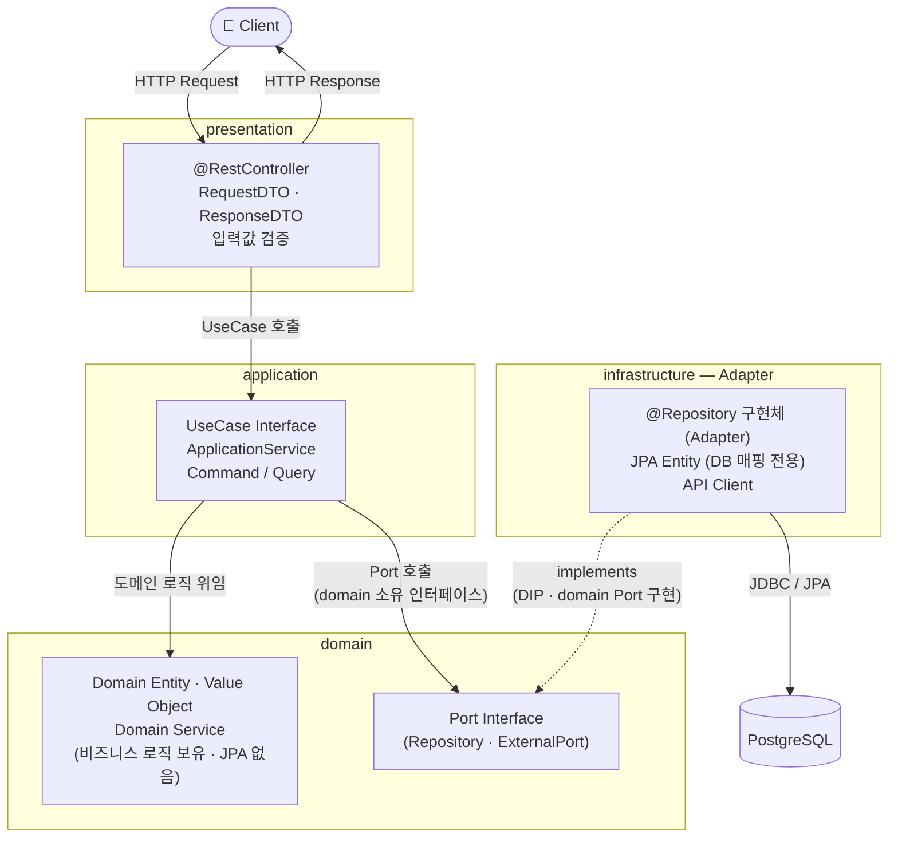
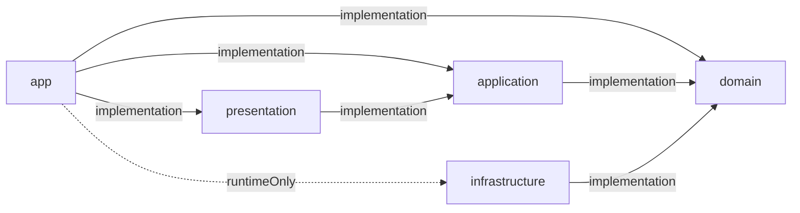
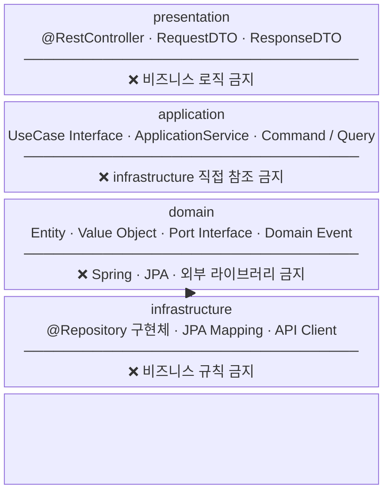

# System Architecture

> **4-Layered Clean Architecture** — Spring Boot 멀티모듈 기반

---

## 전체 아키텍처

```mermaid
flowchart TD
    Client(["👤 Client"])


    subgraph presentation["presentation"]
        Controller["@RestController\nRequestDTO · ResponseDTO\n입력값 검증"]
    end

    subgraph application["application"]
        UseCase["UseCase Interface\nApplicationService\nCommand / Query"]
    end

    subgraph domain["domain"]
        Entity["Domain Entity · Value Object\nDomain Service\n(비즈니스 로직 보유 · JPA 없음)"]
        Port["Port Interface\n(Repository · ExternalPort)"]
    end

    subgraph infrastructure["infrastructure — Adapter"]
        Adapter["@Repository 구현체 (Adapter)\nJPA Entity (DB 매핑 전용)\nAPI Client"]
    end

    DB[("PostgreSQL")]

    Client       -- "HTTP Request"                    --> Controller
    Controller   -- "UseCase 호출"                    --> UseCase
    UseCase      -- "도메인 로직 위임"                 --> Entity
    UseCase      -- "Port 호출\n(domain 소유 인터페이스)" --> Port
    Adapter      -. "implements\n(DIP · domain Port 구현)" .-> Port
    Adapter      -- "JDBC / JPA"                      --> DB
    Controller   -- "HTTP Response"                   --> Client
```

---

## 모듈 의존 관계

```mermaid
flowchart LR
    app["app"]
    presentation["presentation"]
    application["application"]
    domain["domain"]
    infrastructure["infrastructure"]

    app -->|implementation| presentation
    app -->|implementation| application
    app -->|implementation| domain
    app -.->|runtimeOnly| infrastructure

    presentation -->|implementation| application
    application  -->|implementation| domain
    infrastructure -->|implementation| domain
```

---

## 레이어별 책임

```mermaid
block-beta
  columns 1
  P["presentation\n@RestController · RequestDTO · ResponseDTO\n──────────────────────────────────\n❌ 비즈니스 로직 금지"]
  A["application\nUseCase Interface · ApplicationService · Command / Query\n──────────────────────────────────\n❌ infrastructure 직접 참조 금지"]
  D["domain\nEntity · Value Object · Port Interface · Domain Event\n──────────────────────────────────\n❌ Spring · JPA · 외부 라이브러리 금지"]
  I["infrastructure\n@Repository 구현체 · JPA Mapping · API Client\n──────────────────────────────────\n❌ 비즈니스 규칙 금지"]

  P --> A --> D
  I --> D
```
