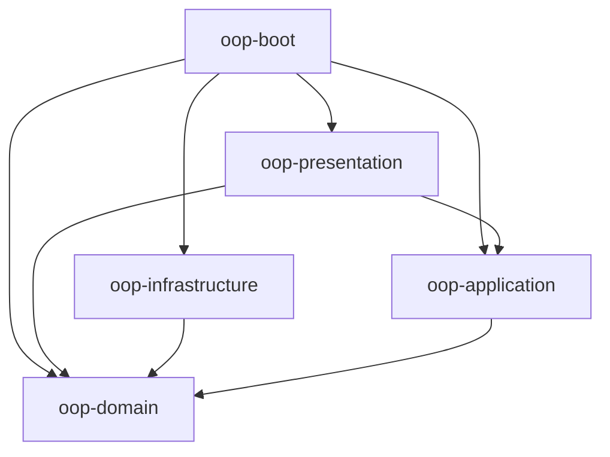

# 시스템 아키텍처 개요

본 문서는 OOP 프로젝트의 전반적인 시스템 아키텍처를 설명합니다. 이 프로젝트는 관심사 분리를 위해 멀티 모듈 구조를 채택하고 있으며, 클린 아키텍처 및 헥사고날 아키텍처 원칙을 지향합니다.

## 모듈 구조

프로젝트는 다음과 같은 모듈로 구성되어 있습니다:

- **oop-boot**: 애플리케이션의 시작점입니다. Spring Boot 설정 및 부트스트래핑을 담당합니다.
- **oop-presentation**: 외부 인터페이스 레이어입니다. REST API 컨트롤러, 공통 응답 포맷(ApiResponse), 전역 예외 처리(GlobalExceptionHandler)를 포함합니다.
- **oop-application**: 핵심 비즈니스 로직과 유즈케이스를 포함합니다. 도메인과 인프라 간의 흐름을 제어합니다. (현재 구현 진행 중)
- **oop-domain**: 시스템의 핵심 도메인 모델입니다. 비즈니스 엔티티, 값 객체, 도메인 예외(DomainException) 등을 포함합니다.
- **oop-infrastructure**: 외부 시스템과의 연동을 담당합니다. 데이터베이스 영속성(JPA), 외부 API 클라이언트 등의 구현체가 위치합니다. (현재 구현 진행 중)

## 모듈 간 의존성 관계

현재 프로젝트의 모듈 간 의존성 흐름은 다음과 같습니다.

- **oop-boot**는 모든 모듈을 조합하여 애플리케이션을 구동하기 위해 모든 모듈에 의존합니다.
- **oop-presentation**은 유즈케이스 실행을 위해 **oop-application**에, 데이터 전달을 위해 **oop-domain**에 의존합니다.
- **oop-infrastructure**는 도메인 인터페이스를 구현하기 위해 **oop-domain**에 의존합니다.
- **oop-application**은 비즈니스 규칙 사용을 위해 **oop-domain**에 의존합니다.

## 주요 구성 요소 및 책임

| 레이어 | 책임 | 주요 구성 요소 |
| :--- | :--- | :--- |
| **Presentation** | HTTP 요청/응답 처리 | Controller, DTO, ApiResponse, GlobalExceptionHandler |
| **Application** | 비즈니스 유즈케이스 오케스트레이션 | Service, Input/Output Port |
| **Domain** | 핵심 비즈니스 규칙 및 상태 | Entity, Value Object, DomainException, Repository Interface |
| **Infrastructure** | 기술적 세부 구현 | Repository Implementation, External API Client, Configuration |

---
*마지막 업데이트: 2026-03-30*
