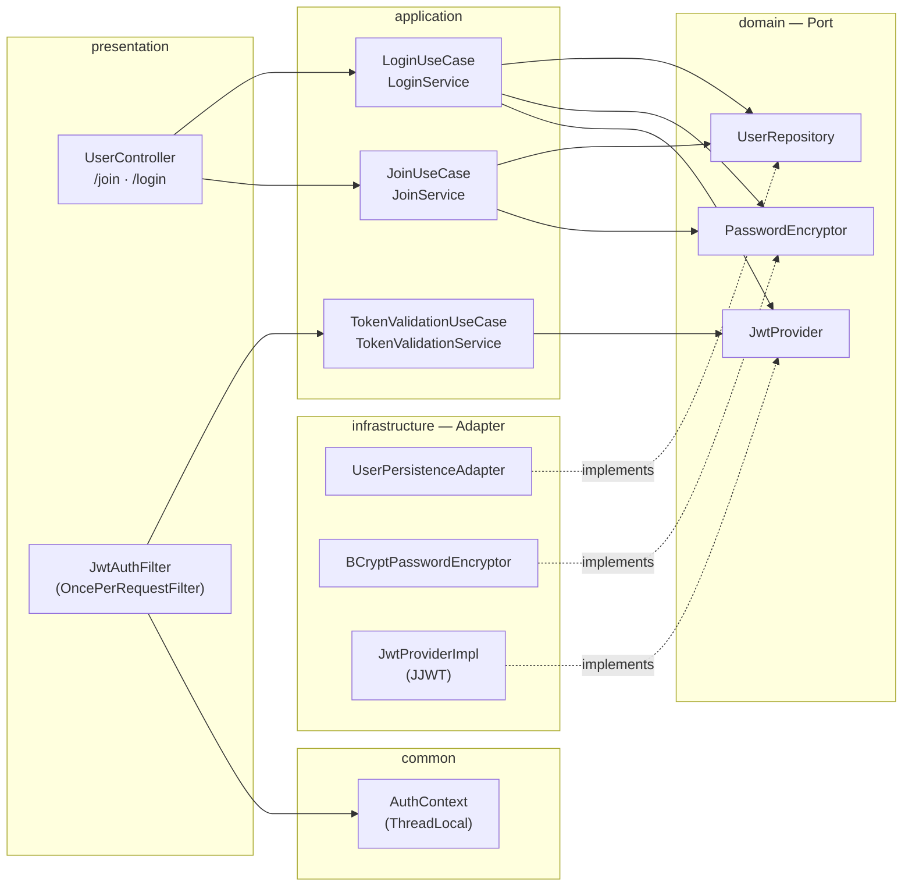
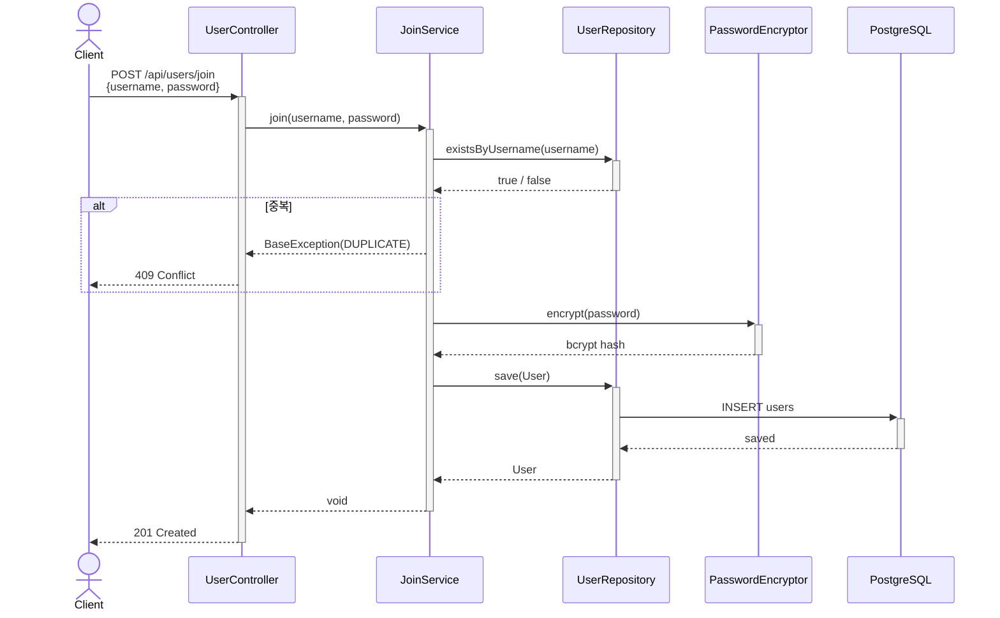
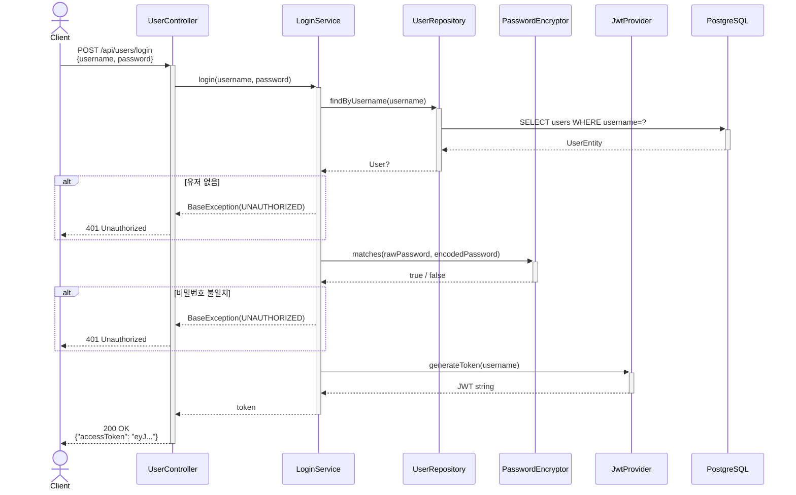

# Authentication — Join & Login

> **Spring Security 미사용** · JWT(JJWT 0.12) · Hexagonal Architecture

---

## 설계 원칙

Spring Security의 필터 체인·`SecurityContextHolder`를 제거하고, 동일한 책임을  
직접 구현한 컴포넌트로 대체한다.

| Spring Security | 이번 구현 |
|---|---|
| `UsernamePasswordAuthenticationFilter` | `LoginService` |
| `AuthenticationManager` / `UserDetailsService` | `UserRepository.findByUsername` |
| `BCryptPasswordEncoder` | `BCryptPasswordEncryptor` (spring-security-crypto만 사용) |
| `SecurityContextHolder` | `AuthContext` (ThreadLocal) |
| 자동 필터 체인 | `JwtAuthFilter` + `FilterRegistrationBean` |

---

## 컴포넌트 배치



---

## 회원가입 (POST /api/users/join)



---

## 로그인 (POST /api/users/login)



---

## 인가 — JWT Filter

모든 `/api/*` 요청에 적용. 토큰이 없거나 유효하지 않으면 차단하지 않고 통과시킨다.  
`AuthContext`가 비어 있는 경우 인증이 필요한 엔드포인트에서 직접 처리한다.

```mermaid
sequenceDiagram
    actor Client
    participant F  as JwtAuthFilter
    participant TV as TokenValidationService
    participant J  as JwtProvider
    participant AC as AuthContext
    participant H  as Controller

    Client ->>+ F: HTTP Request<br/>Authorization: Bearer {token}
    F ->> F: resolveToken()<br/>Bearer 접두사 제거
    F ->>+ TV: validateAndExtract(token)
    TV ->>+ J: isValid(token)
    J -->>- TV: true / false
    alt 유효
        TV ->>+ J: extractUsername(token)
        J -->>- TV: username
        TV -->>- F: username
        F ->>+ AC: set(username)
        AC -->>- F: —
    else 무효 / 없음
        TV -->>- F: null
    end
    F ->>+ H: doFilter (다음 체인)
    H -->>- F: response
    F ->> AC: clear()
    F -->>- Client: HTTP Response
```

---

## 도메인 포트 계약

```kotlin
// 세 포트 모두 oop-domain에 위치 — infrastructure가 단방향으로 구현

interface UserRepository {
    fun save(user: User): User
    fun existsByUsername(username: String): Boolean
    fun findByUsername(username: String): User?
}

interface PasswordEncryptor {
    fun encrypt(raw: String): String
    fun matches(raw: String, encoded: String): Boolean
}

interface JwtProvider {
    fun generateToken(username: String): String
    fun extractUsername(token: String): String
    fun isValid(token: String): Boolean
}
```

---

## API

| Method | Path | Body | 성공 | 실패 |
|---|---|---|---|---|
| `POST` | `/api/users/join` | `{username, password}` | `201` | `409` 중복 |
| `POST` | `/api/users/login` | `{username, password}` | `200 {accessToken}` | `401` 인증 실패 |

**인증이 필요한 엔드포인트** — `Authorization: Bearer <token>` 헤더 첨부.  
유효한 토큰이면 `AuthContext.get()`으로 현재 사용자 username 접근 가능.

---

## JWT 설정

```yaml
# application.yml
jwt:
  secret: <256 bit 이상 랜덤 문자열>
  expiration: 86400000   # 24h (ms)
```

알고리즘: **HMAC-SHA256** · 만료: 발급 기준 24시간
