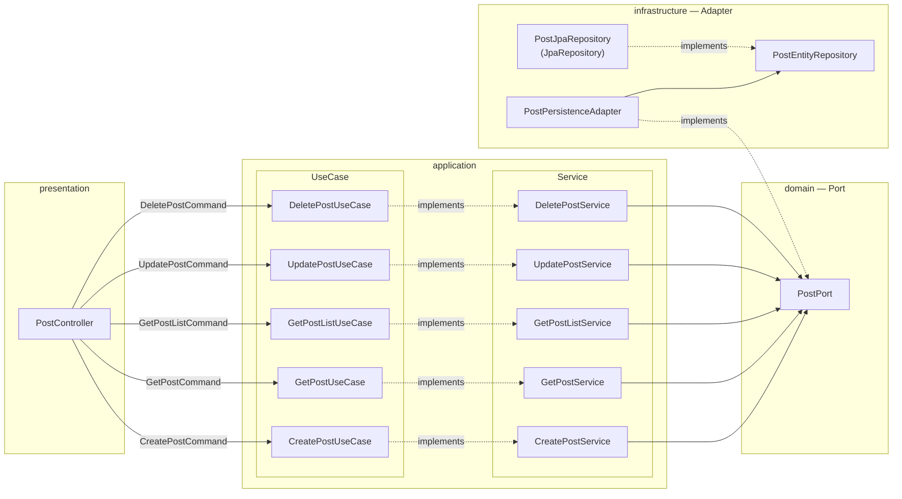
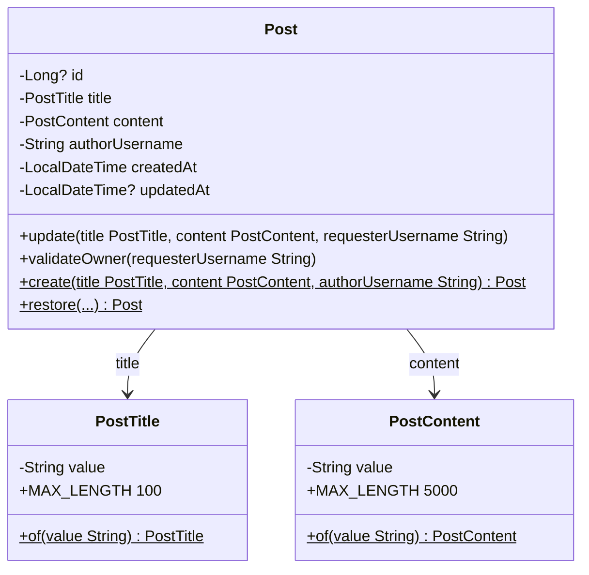
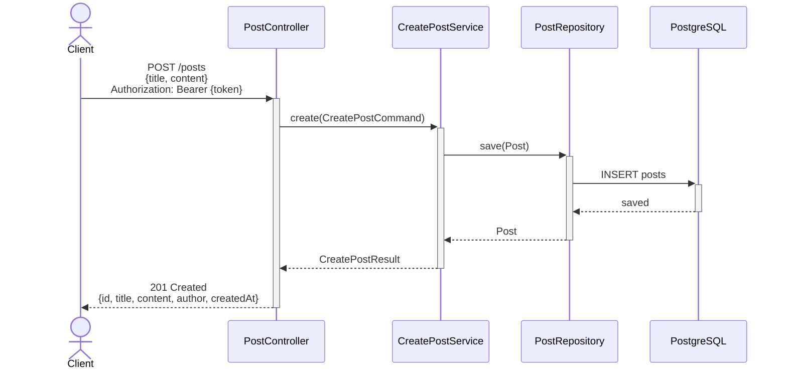
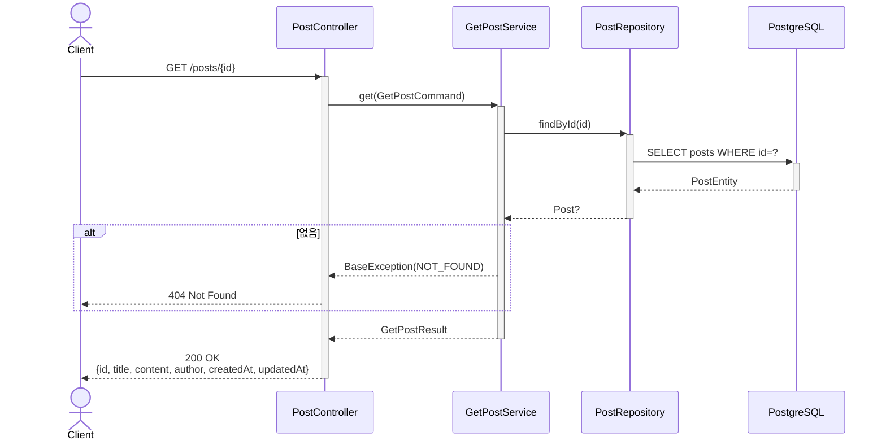
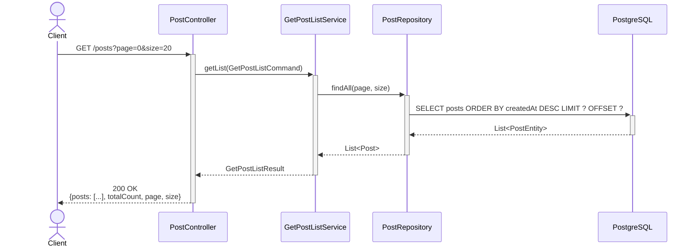
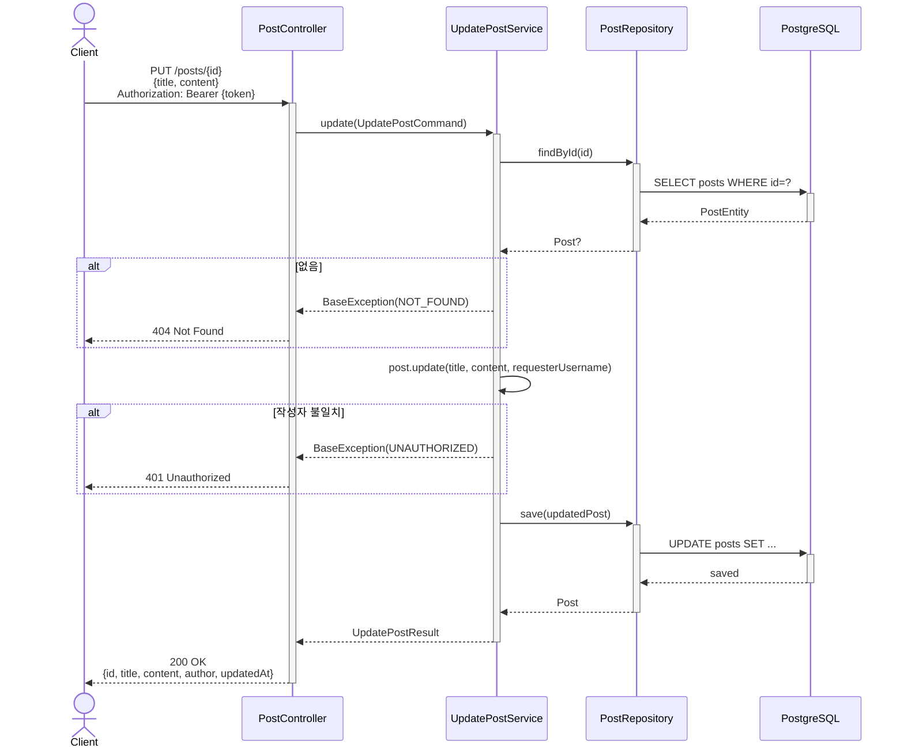
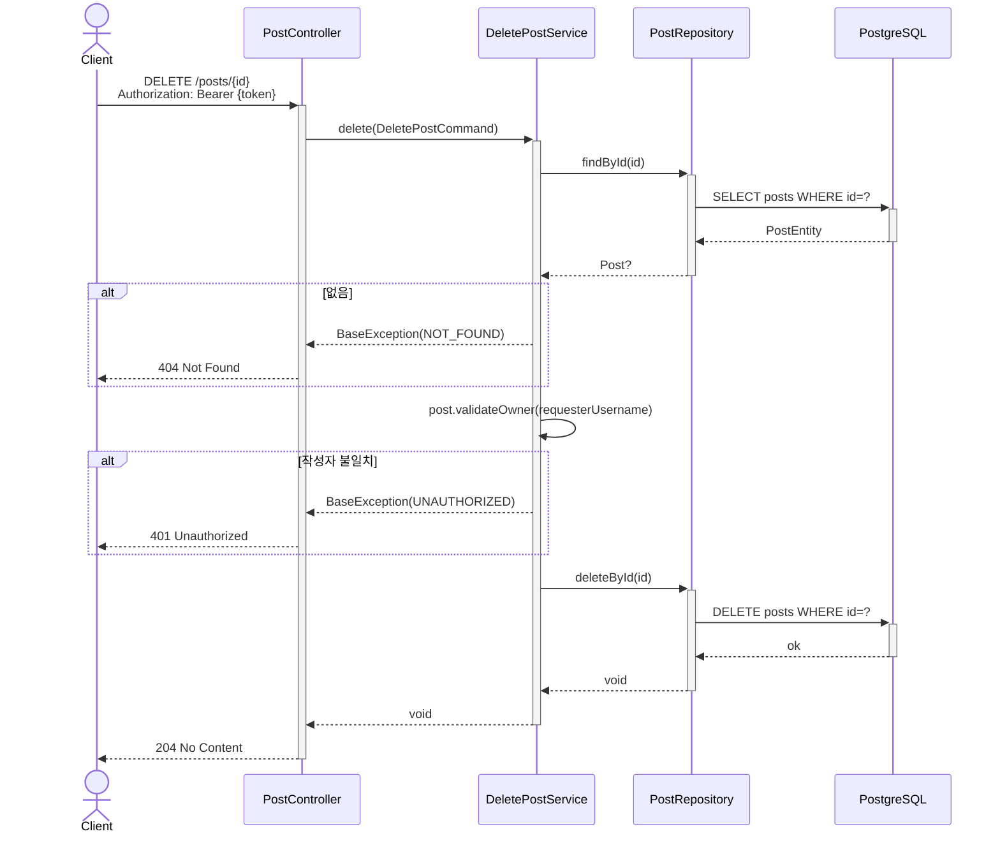
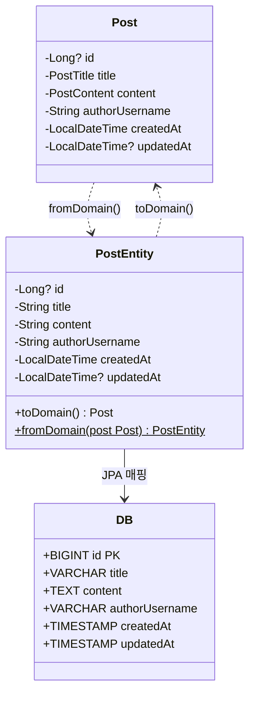

# Board — 게시판

> **Spring Security 미사용** · JWT 인증 연동 · Hexagonal Architecture

---

## 설계 원칙

- 게시글 작성·수정·삭제는 JWT 인증 필요, 조회는 비인증 허용
- 수정·삭제는 작성자 본인만 가능 (서비스 레이어에서 username 비교)
- 도메인 객체(`Post`)가 소유권 검증 책임을 직접 가짐 (TDA 원칙)

---

## 컴포넌트 배치

---

## 도메인 설계

### 비즈니스 규칙

| 구분 | 대상 | 규칙 |
|---|---|---|
| VO | `PostTitle` | 공백 불가 · 최대 100자 |
| VO | `PostContent` | 공백 불가 · 최대 5000자 |
| Entity | `Post.create()` | 새 게시글 — `id` null, `createdAt` 현재시각 자동 |
| Entity | `Post.restore()` | DB 복원 — 규칙 검증 없이 순수 복원 |
| Entity | `Post.update()` | 소유권 검증 → title·content·updatedAt 갱신 |
| Entity | `Post.validateOwner()` | 작성자 불일치 시 `UNAUTHORIZED` |

---

## 게시글 작성 (POST /posts)

---

## 게시글 단건 조회 (GET /posts/{id})

---

## 게시글 목록 (GET /posts)

---

## 게시글 수정 (PUT /posts/{id})

---

## 게시글 삭제 (DELETE /posts/{id})

---

## PostEntity (JPA 매핑)

---

## 에러코드

| 코드 | 상수 | 발생 상황 | 신규 여부 |
|---|---|---|---|
| `D001` | `NOT_FOUND` | 게시글 없음 | 기존 재사용 |
| `D005` | `POST_ACCESS_DENIED` | 본인 게시글 아님 (수정·삭제) | 신규 |

> `D005`를 `A001`로 퉁치지 않고 분리한 이유 — "로그인 안 됨"과 "본인 글 아님"은 클라이언트 입장에서 다른 상황이라 구분하는 게 명확함

---

## API

| Method | Path | 설명 | Body | 인증 | 성공 | 실패 |
|---|---|---|---|---|---|---|
| `POST` | `/posts` | 게시글 작성 | `{title, content}` | 필요 | `201` | `401` |
| `GET` | `/posts` | 게시글 목록 조회 (페이징) | - | 불필요 | `200` | - |
| `GET` | `/posts/{id}` | 게시글 단건 조회 | - | 불필요 | `200` | `404` D001 |
| `PUT` | `/posts/{id}` | 게시글 수정 (본인만) | `{title, content}` | 필요 | `200` | `404` D001 · `403` D005 |
| `DELETE` | `/posts/{id}` | 게시글 삭제 (본인만) | - | 필요 | `204` | `404` D001 · `403` D005 |
