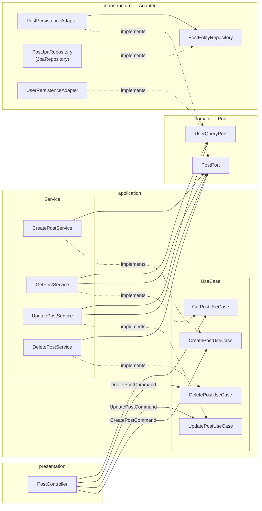
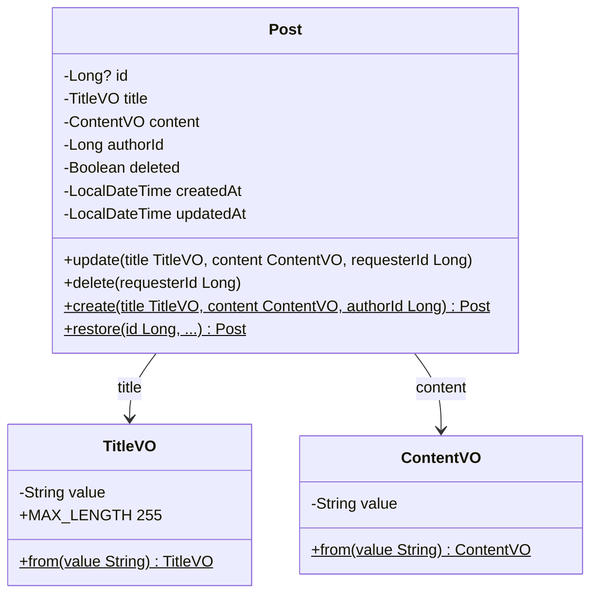
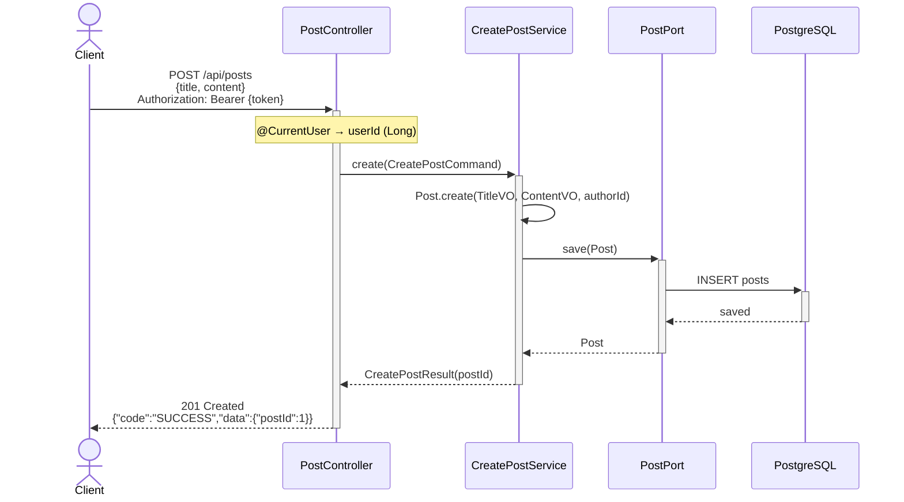
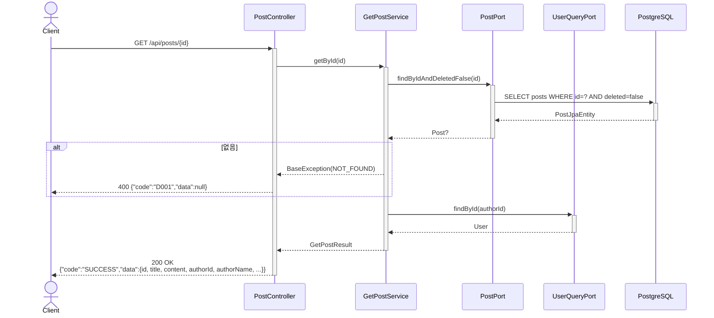
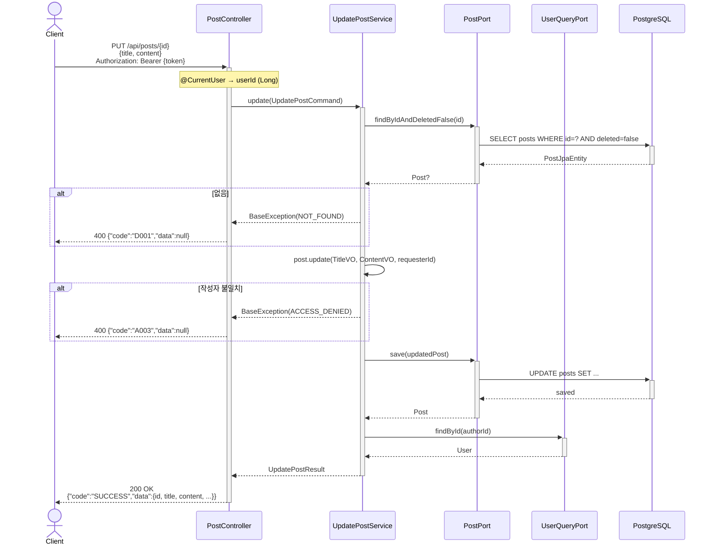
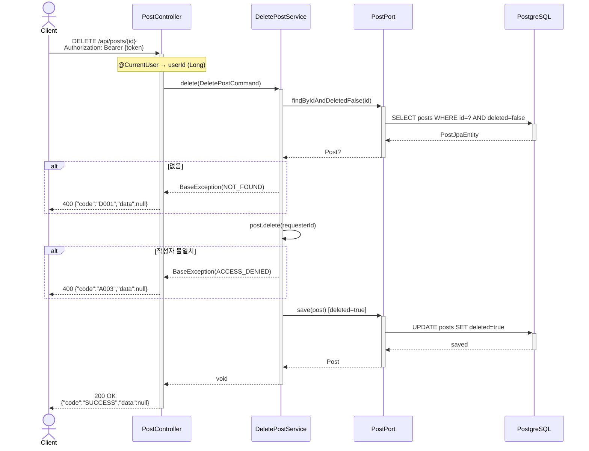
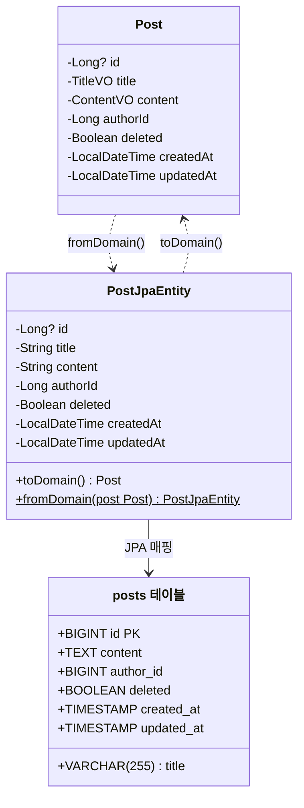

# 게시판 CRUD 설계 검토 요청서

> **Spring Security 미사용** · JWT 인증 연동 · Hexagonal Architecture · 소프트 삭제

## 1. 배경

기존 회원가입/로그인 기능이 완성된 상태에서 게시판 CRUD를 추가합니다. 기존 Hexagonal + 4-Layer 아키텍처를 그대로 따릅니다.

## 2. 요구사항 요약

| 기능 | 인증 | 권한 |
|------|------|------|
| 게시글 생성 | 로그인 필요 | - |
| 목록/단건 조회 | 불필요 | - |
| 수정 | 로그인 필요 | 작성자만 |
| 삭제 (소프트) | 로그인 필요 | 작성자만 |

---

## 3. 컴포넌트 배치



---

## 4. 도메인 설계



### 비즈니스 규칙

| 구분 | 대상 | 규칙 |
|------|------|------|
| VO | `TitleVO` | 공백 불가 · 최대 255자 |
| VO | `ContentVO` | 공백 불가 · 길이 제한 없음 (DB: TEXT) |
| Entity | `Post.create()` | 새 게시글 — `id` null, `deleted` false, `createdAt` 현재시각 |
| Entity | `Post.restore()` | DB 복원 — 비즈니스 규칙 검증 없이 순수 복원 |
| Entity | `Post.update()` | 작성자 검증 → title·content·updatedAt 갱신 |
| Entity | `Post.delete()` | 작성자 검증 → 이미 삭제된 경우 `INVALID_STATE` → `deleted = true` |

---

## 5. 게시글 작성 (POST /api/posts)



---

## 6. 게시글 단건 조회 (GET /api/posts/{id})



---

## 7. 게시글 목록 조회 (GET /api/posts)

```mermaid
sequenceDiagram
    actor Client
    participant C as PostController
    participant S as GetPostService
    participant PP as PostPort
    participant UQP as UserQueryPort
    participant DB as PostgreSQL

    Client ->>+ C: GET /api/posts
    C ->>+ S: getAll()
    S ->>+ PP: findAllByDeletedFalse()
    PP ->>+ DB: SELECT posts WHERE deleted=false
    DB -->>- PP: List PostJpaEntity
    PP -->>- S: List Post
    S ->> S: authorIds = posts.map { authorId }.distinct()
    S ->>+ UQP: findByIds(authorIds)
    UQP ->>+ DB: SELECT users WHERE id IN (...)
    DB -->>- UQP: List User
    UQP -->>- S: Map&lt;Long, User&gt;
    S -->>- C: List GetPostListResult
    C -->>- Client: 200 OK<br/>{"code":"SUCCESS","data":[{id, title, authorId, authorName, createdAt}]}
```

---

## 8. 게시글 수정 (PUT /api/posts/{id})



---

## 9. 게시글 삭제 (DELETE /api/posts/{id})



---

## 10. PostJpaEntity (JPA 매핑)



---

## 11. 주요 설계 판단과 근거

### 11-1. Post 도메인이 비즈니스 로직을 소유 (TDA 원칙)

```
Post.update(title, content, requesterId)  — 작성자 검증 + 수정
Post.delete(requesterId)                  — 작성자 검증 + 소프트 삭제
```

**왜:** 기존 User 도메인도 `User.signUp()`, `User.login()`, `User.authenticate()`로 비즈니스 로직을 도메인이 소유합니다. Service에서 권한 체크를 하면 도메인이 빈혈 모델(Anemic Domain)이 되고, 검증 로직이 여러 Service에 흩어질 위험이 있습니다.

**대안 고려:** Service에서 권한 체크 → 도메인 일관성 깨짐, 기존 User 패턴과 불일치.

### 11-2. VO(TitleVO, ContentVO)로 유효성 캡슐화

**왜:** 기존 프로젝트가 `UsernameVO`, `RawPasswordVO`, `EncodedPasswordVO` 등 VO 패턴을 사용하고 있습니다. VO를 쓰면 객체가 존재하는 순간 유효함이 보장되어, 검증 로직이 중복되지 않습니다. `String` title 자리에 `String` content를 넣는 실수도 컴파일 타임에 방지됩니다.

**대안 고려:** String으로 직접 처리 → 기존 VO 패턴과 불일치, 검증 중복 발생.

### 11-3. 정적 팩토리 메서드로 객체 생성 제한

```kotlin
data class Post private constructor(...) {
    companion object {
        fun create(title, content, authorId): Post    // 신규 생성
        fun restore(id, title, ...): Post             // DB 복원
    }
}
```

**왜:** 기존 `User.signUp()`, `User.login()`, `User.restore()` 패턴과 동일합니다. 생성자를 `private`으로 닫아 잘못된 경로로 객체가 만들어지는 것을 방지합니다. `restore`는 Infrastructure에서 DB → 도메인 변환 시 비즈니스 검증 없이 순수 복원만 수행합니다.

### 11-4. UseCase/Service를 기능별로 분리 (ISP)

```
CreatePostUseCase / CreatePostService
GetPostUseCase    / GetPostService
UpdatePostUseCase / UpdatePostService
DeletePostUseCase / DeletePostService
```

**왜:** 기존 User 도메인이 `JoinUseCase`, `LoginUseCase`, `RefreshUseCase`로 분리되어 있습니다. 하나의 `PostUseCase`에 5개 메서드를 넣으면 ISP(Interface Segregation Principle) 위반이며, Controller가 불필요한 메서드에 의존하게 됩니다.

**대안 고려:** `PostUseCase` 단일 인터페이스 → ISP 위반, 기존 패턴 불일치.

### 11-5. JWT에 userId 추가 (@CurrentUser 반환 타입 변경)

**현재:** JWT에 username만 저장 → `@CurrentUser`가 `String`(username) 반환
**변경:** JWT claims에 userId 추가 → `@CurrentUser`가 `Long`(userId) 반환

**왜:** 게시판에서 `authorId(Long)`로 작성자를 관리합니다. username 기반이면 매 요청마다 username → userId DB 조회가 필요합니다. userId는 불변(PK)이므로 토큰에 포함시키는 것이 안전하고 효율적입니다.

**영향 범위:** JWT 발급-검증 파이프라인 전체 (JwtHandlerPort, RefreshTokenHandlerPort, JwtHandlerAdapter, TokenValidationResult, JwtAuthFilter, CurrentUserArgumentResolver, 기존 Controller)

**대안 고려:**
- Command에 username 전달 → 매 요청 DB 조회 (비효율)
- Post.authorUsername 사용 → username 변경 시 게시글 전체 업데이트 필요

### 11-6. UserQueryPort 분리 (ISP)

```kotlin
interface UserQueryPort {
    fun findById(id: Long): User?
    fun findByIds(ids: List<Long>): Map<Long, User>
}
```

**왜:** 기존 `UserPort`는 회원가입/로그인에 특화된 메서드(register, isUsernameTaken, getByUsername)만 가지고 있습니다. 여기에 `findById`를 추가하면 Post 도메인이 회원가입용 메서드에도 의존하게 됩니다. 조회 전용 Port를 분리하여 ISP를 준수합니다.

**대안 고려:** 기존 UserPort에 추가 → ISP 위반, Post가 불필요한 메서드에 의존.

### 11-7. ErrorCode 범용 코드 재사용

| 상황 | ErrorCode | 근거 |
|------|-----------|------|
| 게시글 미존재 | `NOT_FOUND` (기존 D001) | 도메인별 코드 신설 시 `USER_NOT_FOUND`, `HEALTH_NOT_FOUND` 등 무한 증식 |
| 중복 삭제 | `INVALID_STATE` (기존 D004) | "이미 삭제된 상태"는 유효하지 않은 상태 전이 |
| 권한 없음 | `ACCESS_DENIED` (신규 A003) | 기존에 인가 실패 코드가 없음, `UNAUTHORIZED`는 인증 실패 |

**왜:** 도메인별 코드를 만들면 일관성이 깨지고 ErrorCode enum이 비대해집니다.

### 11-8. 소프트 삭제

**왜:** 실무 수준의 구현을 지향하며, 데이터 복구와 감사 추적이 가능해야 합니다.

**구현:** `Post.deleted` 플래그 + 조회 시 `findByIdAndDeletedFalse`, `findAllByDeletedFalse`로 필터링.

### 11-9. Post-User 간 JPA 연관관계 미사용

**왜:** Post와 User는 별도 Aggregate입니다. `@ManyToOne`으로 직접 연관관계를 맺으면 두 Aggregate가 강하게 결합되어, User 변경이 Post에 영향을 주고 독립적인 생명주기 관리가 어려워집니다. `authorId: Long`으로 ID만 참조하고, authorName이 필요한 시점에 `UserQueryPort`로 별도 조회합니다.

**대안 고려:** `@ManyToOne` 연관관계 → Aggregate 간 강결합, 지연 로딩 이슈, 도메인 경계 모호.

### 11-10. 목록 조회 N+1 및 페이지네이션 미적용

목록 조회에서 `UserQueryPort.findByIds(authorIds)`로 배치 조회하여 N+1 문제를 해결했습니다. 전체 목록을 한 번에 조회하며 페이지네이션은 미적용입니다.

**왜:** `findByIds`로 작성자 ID를 distinct 후 한 번에 조회하면 쿼리 2회(게시글 + 작성자)로 고정됩니다. 페이지네이션은 향후 데이터 증가 시 `Pageable`을 도입하여 해결할 예정입니다.

### 11-11. Infrastructure 3단 구조

```
Adapter → Repository → JpaRepository
```

**왜:** 기존 User 도메인이 `UserPersistenceAdapter → UserEntityRepository → UserJpaRepository` 3단 구조입니다. Adapter는 Port 인터페이스 구현, Repository는 도메인 ↔ JPA Entity 변환, JpaRepository는 순수 JPA 인터페이스로 책임을 분리합니다.

---

## 12. 기존 코드 변경 범위

### JWT 파이프라인 (영향도: 높음)

| 파일 | 변경 내용 |
|------|----------|
| JwtHandlerPort | `generateToken(username, userId)` 시그니처 변경 |
| RefreshTokenHandlerPort | `generateRefreshToken(username, userId)` 시그니처 변경 |
| JwtHandlerAdapter | claims에 userId 추가, 추출 로직 변경 |
| TokenValidationResult | `username: String?` → `userId: Long?` |
| TokenValidationService | userId 기반 변경 |
| LoginService | generateToken에 userId 전달 |
| RefreshService | UserQueryPort 주입, userId로 User 조회 후 토큰 재발급 |
| JwtAuthFilter | attribute "username" → "userId" |
| CurrentUserArgumentResolver | `String?` → `Long?` 반환 |
| UserController.me() | `@CurrentUser` 타입 변경 |

### User 도메인 확장 (영향도: 낮음)

| 파일 | 변경 내용 |
|------|----------|
| UserQueryPort (신규) | `findById(Long): User?` |
| UserEntityRepository | `findUserById(Long): UserEntity?` 추가 |
| UserPersistenceAdapter | UserQueryPort 구현 추가 |

### 공통 (영향도: 낮음)

| 파일 | 변경 내용 |
|------|----------|
| ErrorCode | `ACCESS_DENIED("A003")` 추가 |

---

## 13. 에러코드

| 코드 | 상수 | 발생 상황 | 신규 여부 |
|------|------|----------|----------|
| `D001` | `NOT_FOUND` | 게시글 없음 / 삭제된 게시글 조회 | 기존 재사용 |
| `D004` | `INVALID_STATE` | 이미 삭제된 게시글 중복 삭제 | 기존 재사용 |
| `A001` | `UNAUTHORIZED` | 비로그인 사용자가 인증 필요 API 호출 | 기존 재사용 |
| `A003` | `ACCESS_DENIED` | 본인 게시글 아님 (수정·삭제) | **신규** |

---

## 14. API

| Method | Path | 설명 | Body | 인증 | 성공 | 실패 |
|--------|------|------|------|------|------|------|
| `POST` | `/api/posts` | 게시글 작성 | `{title, content}` | 필요 | `201` | `400` A001 |
| `GET` | `/api/posts` | 게시글 목록 조회 | - | 불필요 | `200` | - |
| `GET` | `/api/posts/{id}` | 게시글 단건 조회 | - | 불필요 | `200` | `400` D001 |
| `PUT` | `/api/posts/{id}` | 게시글 수정 (본인만) | `{title, content}` | 필요 | `200` | `400` D001 · `400` A003 |
| `DELETE` | `/api/posts/{id}` | 게시글 삭제 (본인만, 소프트) | - | 필요 | `200` | `400` D001 · `400` A003 |

> 현재 `GlobalExceptionHandler`가 `BaseException`을 400으로 일괄 처리하므로 모든 비즈니스 에러가 400입니다.
> 향후 ErrorCode에 httpStatus 필드를 추가하면 404/403 등 적절한 매핑이 가능합니다.

---

## 15. 예외 처리 전략

- 기존 `BaseException` + `ErrorCode` 패턴을 그대로 사용
- 도메인별 ErrorCode를 만들지 않고 범용 코드를 재사용
- 현재 `GlobalExceptionHandler`가 `BaseException`을 400으로 일괄 처리하므로 이에 맞춤
- 향후 ErrorCode에 httpStatus 필드를 추가하면 404(NOT_FOUND), 403(ACCESS_DENIED) 등 적절한 매핑 가능

---

## 16. 검토 요청 사항

다음 부분에 대한 피드백을 부탁드립니다:

1. **JWT 변경 범위의 적절성** — userId를 JWT에 포함시키는 접근이 맞는지, 변경 범위가 과하지 않은지
2. **Post-User 간 관계** — JPA 연관관계 없이 authorId(Long)만 참조하고, Service에서 별도 조회하는 방식이 적절한지
3. **UserQueryPort 분리** — ISP를 위해 새 인터페이스를 만드는 것이 맞는지, 기존 UserPort에 추가해도 되는지
4. **도메인 로직 배치** — 권한 검증(update/delete)을 도메인에 두는 것이 맞는지, Service 레이어가 더 적절한지
5. **ErrorCode 전략** — 범용 코드 재사용 vs 도메인별 코드 신설, 어느 쪽이 장기적으로 나은지
6. **소프트 삭제** — deleted 플래그 방식이면 충분한지, 삭제 시간(deletedAt) 등 추가 필드가 필요한지
7. **전반적인 설계 품질** — 놓치고 있는 부분이나 개선할 점이 있는지
